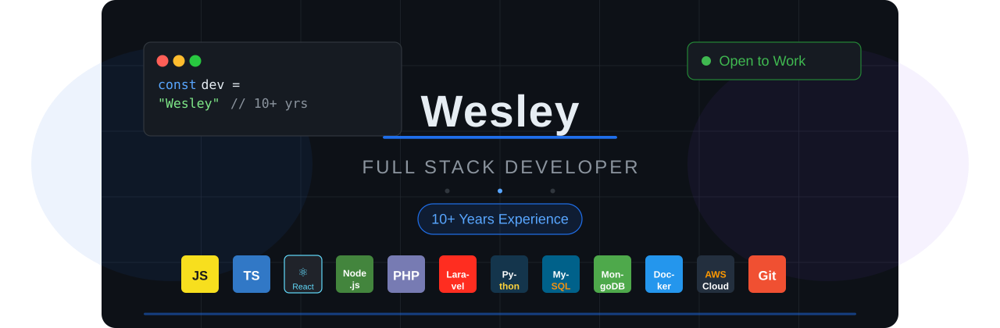

  

<h1 align="center">Hey everyone 👋</h1>
<h3 align="center">A Passionate Full-Stack Developer with 10+ Years of Experience</h3>

  

---

## 👨‍💻 About Me:

- 🏆 I carry **10+ years of experience** working as a software and web developer
- 🌍 I have encountered a number of different **projects and positions** across my career
- 🔄 My **flexible nature** has always been a plus — I can learn new systems very fast and adapt to virtually any working environment
- 🚀 The combination of my **programming, communication and management skills** have helped me to successfully deliver projects on time with high quality
- 💬 Ask me about **JavaScript, React, Node.js, PHP/Laravel, Python, Cloud & DevOps**

---

## 🛠️ Things I Code With:

  <!-- Languages -->
  
  
  
  

  <!-- Frontend -->
  
  
  
  
  

  <!-- Backend -->
  
  
  

  <!-- Databases -->
  
  
  
  

  <!-- DevOps & Cloud -->
  
  
  

  <!-- Tools -->
  
  
  
  

---

## GitHub Analytics

 

 

---
